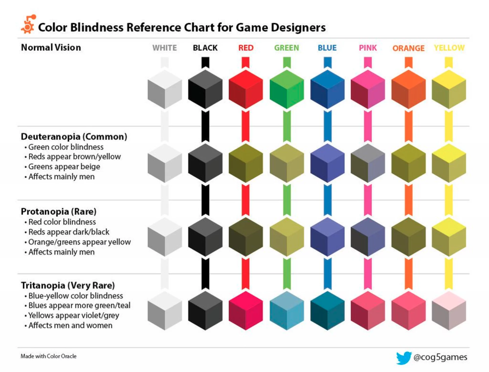
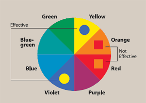

# How to create an accessable and inclusive design.
For a certain course in the minor webdevelopment I created an website with mostly purely CSS. The purpose of this website was to create something fun, unique, crazy and just letting your creativity flow. And ofcourse educating yourself in the art that is CSS, which proved to be more difficult than I had originally anticipated. While that was all fun and games and I created something I was actually quite proud of, I need touch the subject of UX, accessability and inclusivity. Because interaction design is a subject I only briefly touched while I creating this website, but it could be more meaningfull for everybody when diving deeper into these subjects.


## Accessability and Inclusive Design 
Inclusive design means you create something for different users, where you will automatically run into the matter of accessability. To create a website that is accessable you will also make it more inclusive, which is great! The internet for everybody and so your website should also be for everybody. Although this is not always managable in the workfield, it is still good to wrap your head around it from time to time. The problem with accessability mostly comes down to the following:

> ### _"Most don't design to exclude - they just don't know what they don't know..."_ - **Micheal Osborne**

### Animations
Personally I love animations, they add such a fun an creative aspect to an website. Plus they're fun to make! BUT there is a big but in this equation. Firstly you need to use animations wisely, don't overdo it because this can be distracting for the user. For example you could use an animation to give the user feedback, but don't let something continuously flicker on the screen. As a matter of fact don't ever do that, unless you know for sure you do not have users with "photosensitive epilepsy" because these animations could be seriously harmfull for them.

In my website I do not use flickering animations, however the purpose was to create something crazy, so I definitely did overdo it on the animations. Since removing this will butcher the concept I need to find other ways around this problem. On twitter I found a solution to this problem, though I find that twitter doesn't use excessive animations in the application it is still a great feature that could potentialy make my application better. Slack also has this option in the settings!


Eventough that is a great solution it is also important to think about the animations as to why their neccessary and do they really have to move that fast? For example the iOS 7 design caused some users motion sickness, due to intensive parallax and zoom animations. So eventhough iOS 7 was way ahead in accessability their design wasn't designed for users who suffer from motion sickness. Refering to the _'they just don't know what they don't know...'_ Things that are constantly moving can also serve as an distraction from the content of your webpage, thus I probably should also want to stop the moving fish on my screen.

### Color
During my studies something that always stayed with me, is to not create hierarchy with colors, because not everyone is able to see them properly. I used mainly blue, while the main context is white for people with colorblindless this will provide enough contrast. However I might want to use a darker shade of blue to create even more contrast between colors. Then we have the matter of the jellyfish and all the hover animations. 



As you can see pink and orange do not provide a lot of contrast, when the user is suffering from colorblindness.



But does provide enough contrast when orange is used with yellow. So I might want to change the colors or provide a colorblind control next to the 'stop animations' control, so the user can turn this on or off. Twitter also used a control to increase contrast between colors, which I also found a great idea. All these settings for Twitter can conveniently be found in the _'Accessability'_ tab. But when changing these colors, the contrast between yellow and white will be very hard to distinguish. Color will always be a tricky one, especially when dealing with branding. Websites like Trello provide contrast while using different patterns, so users are still able to distinguish the difference between colors, without actualy seeing them.

### Fonts and readability
As you can see I used a two different kind of fonts, both being decorative fonts to add a look and feel to the website, which is total bullocks if you want to make you website accessable. Yes you can create it with fonts, but you can also choose more readable fonts. For instance users who are dyslexic have a hard time distinguising small, cursive, capitalized letters and small spacing in a font. 
Being dyslexic myself I can totally vouch for this. I always make my font bigger make it easier to read. Thus it's also important to check if a font is scalable, especially since we use so many devices varying from large to small screens. So I definitely need to change the font of my website. Maybe ```'Arial'``` for my main context making it at least ```16px``` and adding another sans-serif font. Because these fonts are the best for people with dyslexia. 

It is also important create some sort of hierarchy in your textual content. I used headers to create a difference between an item on the menu and an explanation about that item and of course the different courses that are on the menu. It's also prefered to have 45 to a maximum of 75 characters on one line, too much makes it less readable, while having short lines may cause an eye strain because they have to switch between lines constantly.


### Images
The jellyfish in the background creates a meaning to the website: It's a menu of a fish restaurant. Tough right now it's not provided with an `````` element, because it's an svg, meaning it also has no ```alt``` text and can't be read by screenreaders. To make those users aware of what happens in the background you can create an hidden `````` element with an alt text describing the image, so the users that will make use of a screenreader will also be able to hear this. It's even possible to create a link for that image, so the user can get more information about that image, than just the alt text. Maybe even describing what happens in the animation. 

### Structure
For this project I got an basic HTML template, so I immediately move on to styling. In doing so I completely slipped my mind to check the HTML structure to see if it's accessable. Well I can tell you one thing... it's not.

```html
<section id="maincourse" class="l-column">

		<header class="type-course">
			<h2>Maincourse</h2>
			<p>
				To be shared
			</p>
		</header>

		<article>
			<h3>Smoked fish</h3>
			<p>
				<em>serves 3 - 4 people</em> with cream cheese, onion, tomato, capers &amp; 
				new potato salad and Russ &amp; daughters bread basket
			</p>
			<div class="price">60</div>
		</article>

		<article>
			<h3>The hattie</h3>
			<p>
				smoked whitefish, kippered (baked) salmon, gaspe nova smoked salmon, sable
			</p>
			<div class="price">80</div>
		</article>

		<article>
			<h3>The ida</h3>
			<p>
				scottish smoked salmon, gaspe nova smoked salmon, pastrami-cured salmon, gravlox
			</p>
			<div class="price">70</div>
		</article>

		<article>
			<h3>The anne</h3>
			<p>
				western nova smoked salmon, private stock sturgeon, sable, smoked brook trout, 
				wild alaskan salmon roe
			</p>
			<div class="price">90</div>
		</article>

	</section>
```
This is how the code is looking right now. Creating articles in section is fine, but essentially it's a list of items you want your user to go through. Right now the screenreader doesn't know these are items that belong to a list. It's much wiser to create an list ```<ul>``` with list-items ```<li>`` that will contain the articles. However it was very smart to provide a header in a section, because a screenreader will recognize this as an introduction to this section. This will be an improved version of the code:

```html
<section id="maincourse" class="l-column">

		<header class="type-course">
			<h2>Maincourse</h2>
			<p>
				To be shared
			</p>
		</header>

        <ul>
            <li>
                <article>
			        <h3>Smoked fish</h3>
			        <p>
			        	<em>serves 3 - 4 people</em> with cream cheese, onion, tomato, capers &amp; 
			        	new potato salad and Russ &amp; daughters bread basket
			        </p>
			        <div class="price">60</div>
		        </article>
            </li>
            <li>
                <article>
			        <h3>The hattie</h3>
			        <p>
			        	smoked whitefish, kippered (baked) salmon, gaspe nova smoked salmon, sable
			        </p>
			        <div class="price">80</div>
		        </article>
            </li>
            <li>
                <article>
			        <h3>The ida</h3>
			        <p>
			        	scottish smoked salmon, gaspe nova smoked salmon, pastrami-cured salmon, gravlox
			        </p>
			        <div class="price">70</div>
		        </article> 
            </li>
            <li>
                <article>
			        <h3>The anne</h3>
			        <p>
			        	western nova smoked salmon, private stock sturgeon, sable, smoked brook trout, 
			        	wild alaskan salmon roe
			        </p>
			        <div class="price">90</div>
		        </article>
            </li>
        </ul>

	</section>
```

## Conclusion
* Animation are fun but use them wisely, so you don't cause any discomfort for the user or distract them.
* Colors will always be tricky, especially in creative projects. Use colors wisely and make sure the purpose of the website won't change when not using any color by creating hierarchy without color. And always check contrast between colors.
* Your content should always be readable for every user, by providing the right fonts and structure to your textual content.
* When making a website accessable for a screenreader it is important to understand a screenreader so you can create a beter HTML structure.


