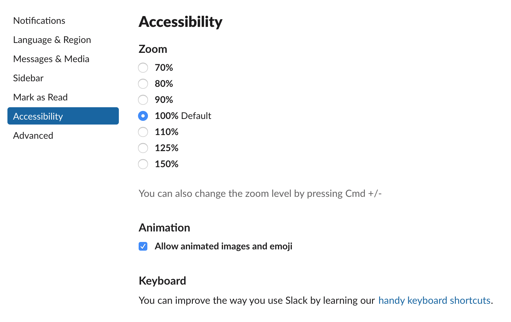

# How to create an accessable and inclusive design.
For a certain course in the minor webdevelopment I created an website with mostly purely CSS. The purpose of this website was to create something fun, unique, crazy and just letting your creativity flow. And ofcourse educating yourself in the art that is CSS, which proved to be more difficult than I had originally anticipated. While that was all fun and games and I created something I was actually quite proud of, I need touch the subject of UX, accessability and inclusivity. Because interaction design is a subject I only briefly touched while I creating this website, but it could be more meaningfull for everybody when diving deeper into these subjects.

## Accessability and Inclusive Design 
Inclusive design means you create something for different users, where you will automatically run into the matter of accessability. To create a website that is accessable you will also make it more inclusive, which is great! The internet for everybody and so your website should also be for everybody. Although this is not always managable in the workfield, it is still good to wrap your head around it from time to time. The problem with accessability mostly comes down to the following:

> ### _"Most don't design to exclude - they just don't know what they don't know..."_ - **Micheal Osborne**

### Animations
Personally I love animations, they add such a fun an creative aspect to an website. Plus they're fun to make! BUT there is a big but in this equation. Firstly you need to use animations wisely, don't overdo it because this can be distracting for the user. For example you could use an animation to give the user feedback, but don't let something continuously flicker on the screen. As a matter of fact don't ever do that, unless you know for sure you do not have users with "photosensitive epilepsy" because these animations could be seriously harmfull for them.

In my website I do not use flickering animations, however the purpose was to create something crazy, so I definitely did overdo it on the animations. Since removing this will butcher the concept I need to find other ways around this problem. On twitter I found a solution to this problem, though I find that twitter doesn't use excessive animations in the application it is still a great feature that could potentialy make my application better. Slack also has this option in the settings!

Eventough that is a great solution it is also important to think about the animations as to why their neccessary and do they really have to move that fast? For example the iOS 7 design caused some users motion sickness, due to intensive parallax and zoom animations. So eventhough iOS 7 was way ahead in accessability their design wasn't designed for users who suffer from motion sickness. Refering to the _'they just don't know what they don't know...'_