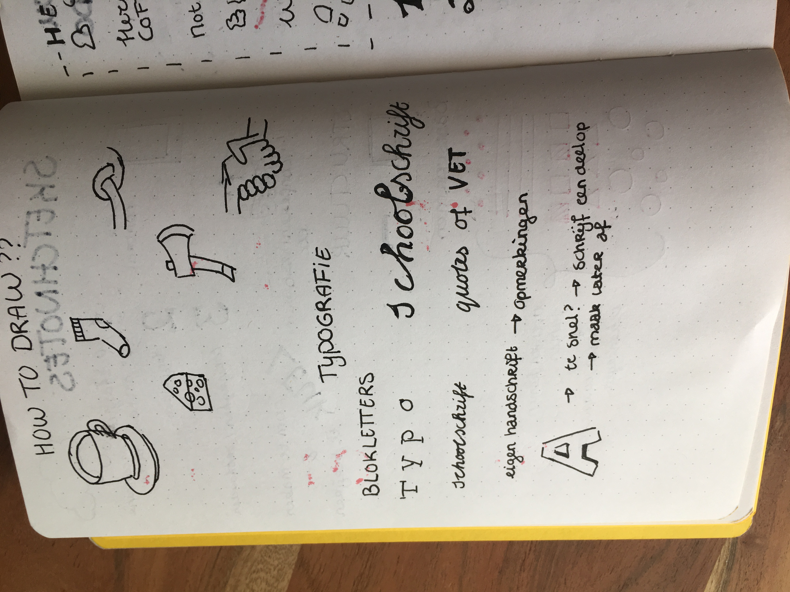

# Weekly nerd
Guest lectures during the minor webdevelopment.

## Sketchnotes met Maaike van Cruchten en Brit Wijnmaalen

    
Sketchnotes

## Stephan Hay over Design Patterns

    
Sketchnotes

## Cyd Stumpel (ex) & Dennis Spierenburg (ex) over werken als Frontender bij Matise

    
Sketchnotes

## Maike Klip over ontwerpen voor vluchtelingen
Unfortunately I was sick at home this week.

## Ischa Gast over A11y

    
Sketchnotes

## Workshop PE

    
Sketchnotes

## Daan Rongen over afstuderen en je eigen signatuur behouden

    
Sketchnotes

